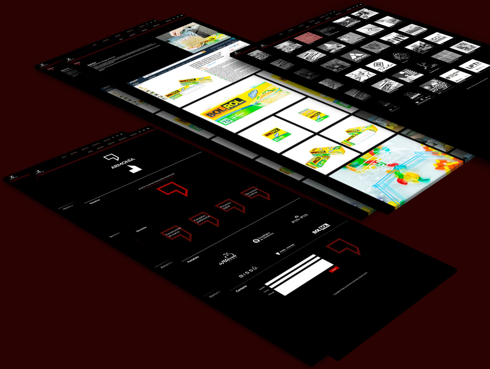

## Descripción de proyecto

Sitio web para [Katartico] (https://katartico.mx/), una agencia de publicidad en Monterrey, N.L. El proyecto tuvo una duración de 6 meses y fue realizado en colaboración con la agencia, quienes fueron los encargados de diseñar la interfaz de usuario.

El proyecto estuvo dividido en 2 etapas: desarrollo del sitio con base en el diseño e implementación del sistema de manejo de contenido o CMS. El objetivo principal del sitio es promover la marca de la agencia y destacar los proyectos más importantes en los que han participado.

[Visitar sitio] (https://katartico.mx/)

