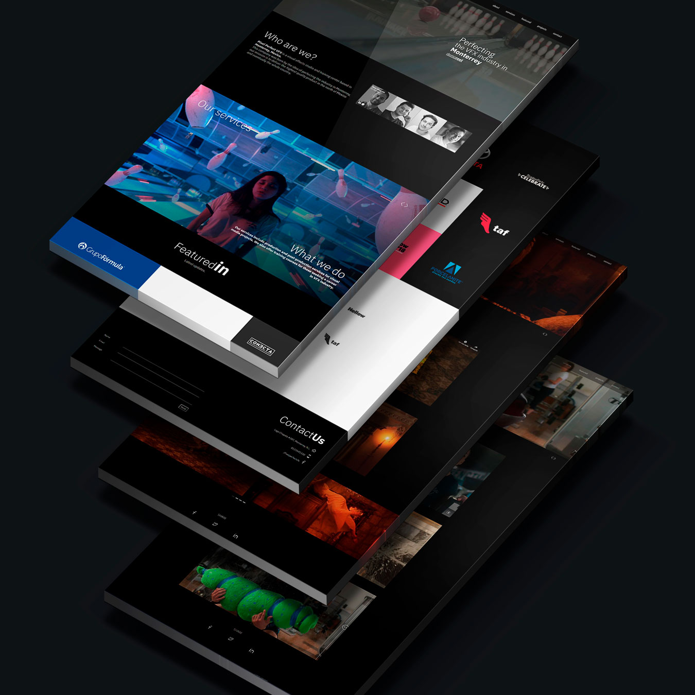

## Descripción de proyecto

Sitio web para [Pixel Perfect] (https://pixelperfectvfx.com/), un estudio de VFX con sede en Monterrey, N.L. El proyecto tuvo una duración de 1 año y estuvo dividido en tres etapas: diseño, desarrollo e implementación.

El sitio tiene como objetivo destacar los servicios y el portafolio del estudio, con  un diseño hecho a la medida y optimizado para diferentes dispositivos y navegadores. Por lo mismo, el sistema de manejo de contenido, o CMS, es personalizado, permitiendo al administrador del sitio modificar el contenido e información con facilidad. 

[Visitar sitio] (https://pixelperfectvfx.com/)

