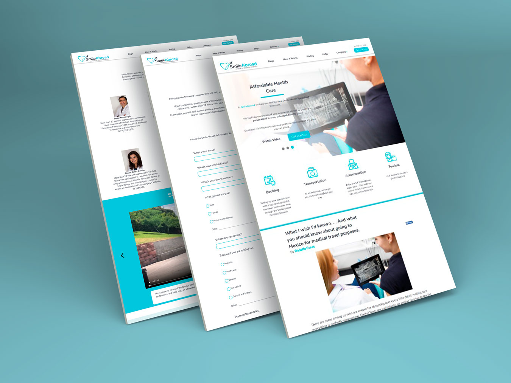

## Descripción de proyecto

Sitio web para [SmileAbroad] (https://smileabroadco.com/), una propuesta de turismo dental para pacientes en Estados Unidos que buscan servicios médicos en México. SmileAbroad facilita el traslado, ofreciendo un paquete integral para que los pacientes, además de recbir su tratamiento dental, tengan la oportunidad de conocer y descubrir la ciudad donde recibirán su servicio. 

El objetivo del sitio es ofrecer información importante para los posibles pacientes para que conozcan el proceso y actividades del servicio. También esta integrado un formulario para que los prospectos registren su información y el administrador del sitio pueda hacer el contacto con ellos. El proyecto tuvo una duración de 7 meses, desde la planeación, pasando por el diseño y desarrollo, hasta la implementación. 

[Visitar sitio] (https://smileabroadco.com/)

